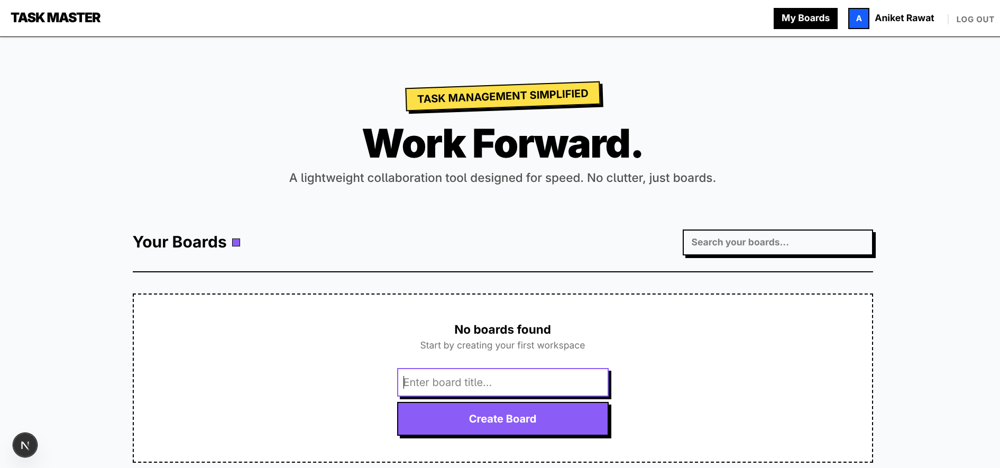

# Task Master: Real-Time Task Collaboration Platform (Hintro-project)


Task Master is a lightweight Trello/Notion-style task management platform with real-time collaboration.

Users can create boards, manage lists and tasks, assign members, and see live updates instantly.

## 🚀 Live Features

### 🔐 Authentication
- Signup & Login
- Session-based authentication
- Password hashing using bcrypt
- Currently supports Admin login

### 🗂 Boards
- Create boards
- Search boards
- Delete boards
- Pagination on dashboard

### 📋 Lists & Tasks
- Create multiple lists inside a board
- Create, update, delete tasks
- Drag and drop tasks across lists
- Reorder tasks inside lists

### 👤 Task Assignment
- Assign tasks using a simple text input
- Admin can type a member name directly on the task card
- Assigned name appears on the task

### ⚡ Real-Time Updates
- Multiple users can open the same board
- Changes reflect instantly using WebSockets
- No manual refresh required

### 📝 Activity History
- Tracks create, update, delete actions
- Shows board-level activity log


## ⚙️ Technical Features

### 📱 Responsive Design
- Neo-brutalist UI style  
- Built using Tailwind CSS  
- Clean, bold, and high-contrast design  

### 🛡️ Type Safety
- End-to-end type safety using TypeScript  
- Input validation using Zod  
- Strong typing across frontend and backend  

### ⚡ Performance
- Server-Side Rendering (SSR) for faster initial load  
- Uses Server Components to reduce client-side JavaScript  


## 🏗️ Architecture Explanation


### 🎨 Frontend Architecture

The frontend is built using **Next.js**.

### 🧱 Server Components
- Used for high-performance data fetching  
- Fetch Boards, Lists, and Tasks directly from the database  
- Reduce client-side JavaScript  
- Improve initial page load speed  

### 🎛️ Client Components
- Used for interactive elements such as:
  - Drag-and-Drop functionality  
  - Real-time WebSocket listeners  
  - Modal forms  
  - Inline editing  

### 🧠 State Management
- URL-based state for:
  - Search  
  - Pagination  
- React hooks for:
  - Editing modes  
  - Modal visibility  
  - Optimistic updates  
- Keeps UI responsive and clean  


## ⚙️ Backend Architecture

The backend follows a **Serverless-ready architecture** using **Next.js Server Actions**.

### ⚡ Server Action Pattern
Direct Mutations: All data changes including task updates, board creation, and list management are handled via dedicated server-side functions in the actions/ directory.

Type-Safe Bridge: Provides a secure and type-safe connection between the UI and the Prisma ORM, ensuring data consistency throughout the application.

Reduced Latency: By executing on the server, these actions reduce the need for client-side API fetching boilerplate and simplify the overall project structure.

### 🔒 Security
- Authentication middleware protects private routes  
- Server-side ownership checks  
- Users can only modify boards they own  


## 🗄️ Database Schema

The database is built using **PostgreSQL** with **Prisma ORM**.

### 👤 User
- Stores credentials and profile information  

### 🗂️ Board
- Main workspace  
- Owned by a User  

### 📋 List
- Child entity of a Board  
- Contains ordered tasks  

### 📝 Task
- Individual task inside a List  
- Contains:
  - Title  
  - Description  
  - Status  
  - `assignedTo`   

### 📜 AuditLog
- Stores chronological records of board activity  
- Tracks Create, Update, Delete actions  
- Powers the Activity History feature  

## 📡 Real-Time Sync Strategy

The application uses WebSockets for real-time sync.

Event Emission: When a user performs an action (e.g., moving a card or updating a title), the client emits a change event to a specific "Board Room" via the WebSocket server.

Broadcast: The server broadcasts this event to all other clients currently viewing the same Board ID.

Refetch: Receiving clients trigger a non-blocking router.refresh(), fetching the latest data from the server and updating the UI without a full page reload.

## 🛠️ Setup Instructions

### 1. Clone the Repository

```bash
git clone https://github.com/AniketR10/hintro-project
cd hintro-project
```

### 2. Install Dependencies

```bash
npm install
```

### 3. Environment Variables
Create a .env file in the root directory:

```bash
DATABASE_URL="your_postgresql_connection_string"
```
### 4. Database Setup

```bash
npx prisma db push
npx prisma generate
```

### 5. Run the Application

```bash
npm run dev
```
The project will be available at: http://localhost:3000

### 📝 Demo Credentials
```bash
 Email: admin@gmail.com
 Password: admin123
```

Use these to login and test or you can singnIn wioth your own email and password also.


## 📈 Scalability

### db Speed (Indexing)

As the number of tasks grows into the thousands, database queries can slow down. To prevent this, indexes are added on `boardId` and `listId`. This works like the index at the back of a textbook  instead of scanning every record, the database can directly locate the required data, making queries much faster.

### Loading in Chunks (Pagination)

Instead of loading hundreds or thousands of boards at once, the application loads only 8 boards per page. When the user clicks "Next", the next 8 boards are fetched from the server. This prevents browser overload and keeps the dashboard fast and responsive regardless of scale.

### Websockets (using Socket.io)

Real-time updates are scoped to specific board rooms. When a user moves a card, the update is only sent to users currently viewing that board. Users on other boards are not affected, which saves bandwidth and improves performance as the number of users increases.

### Efficient Data Fetching

Prisma’s `include` feature is used to fetch related data (lists and tasks) in a single query instead of making multiple small database calls. This reduces database round trips and improves overall performance.

## ⚖️ Trade-offs

When a change happens, the app tells other connected browsers to refresh their data.

**Pro:** This approach is simple to implement and ensures everyone sees the exact same source of truth from the database.

**Con:** It is slightly slower than an Optimistic UI approach (where the UI updates before the server confirms).

#### Activity History

A separate `AuditLog` table is used to track activity history.

**Pro:** This keeps the main `Task` and `Board` tables clean and fast, since history data is stored separately.

**Cons:** The database performs two writes for every change (one for the main action and one for the log).